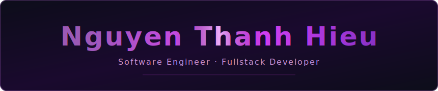

<!-- Banner SVG shimmer - file banner.svg để trong cùng repo -->

  

<!-- Typing: 2 dòng luân phiên -->

  

<!-- Thông tin cố định -->

  📍 Da Nang, Vietnam &nbsp;·&nbsp; 🎓 University of Science and Technology - The University of Da Nang – GPA 3.96/4.0 &nbsp;·&nbsp; 🏆 TOEIC 925

---

## 🛠️ Tech Stack

**Backend**

**Frontend**

**DevOps & Tools**

---

## 🚀 Featured Projects

### 🗂️ [Trello Clone](https://github.com/flyingdoggoo/trello-clone)
> Fullstack clone of the Trello task management tool

**🔗 Live Demo:** https://s-group-trello-pro.vercel.app/login

**🧪 Test Account:** Email: `test@gmail.com` · Password: `test@gmail.com`

- 🔐 **RBAC** – Role-based access control at database design level
- 🎨 **Frontend** – React, Tailwind CSS, shadcn/ui, Zustand state management
- ⚙️ **Backend** – Node.js, Express.js, TypeScript, PostgreSQL + Prisma, REST API
- 🐳 **Deploy** – Docker, Vercel

---

### 🩺 [Fall Detection Smart Wearable Device](https://github.com/flyingdoggoo/Fall-Detection-Smart-Wearable-Device)
> IoT wearable system that detects falls in real-time and sends emergency alerts

---

### 🎥 [DUT Meeting](https://github.com/flyingdoggoo/dut-meeting)
> Real-time online communication platform with AI-powered live subtitles

- 💬 **Realtime** – Socket.IO + WebRTC for video/audio communication
- 🤖 **AI** – Whisper model + Workers for real-time subtitle generation
- 🎨 **UI** – React, Bootstrap, shadcn/ui
- ☁️ **Deploy** – AWS

---

  <i>Open to internship opportunities in Backend / Fullstack development!</i>

  
  
  

